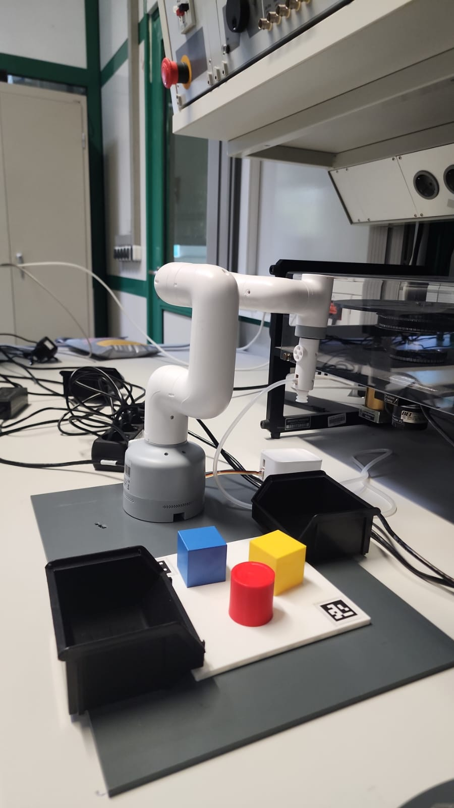
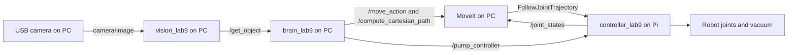
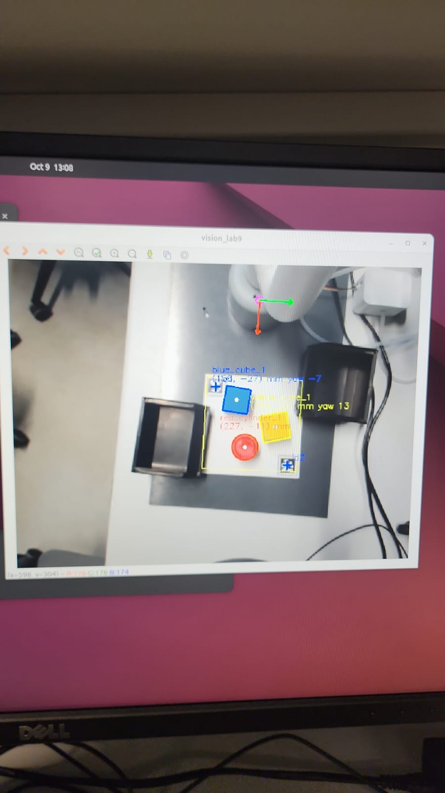
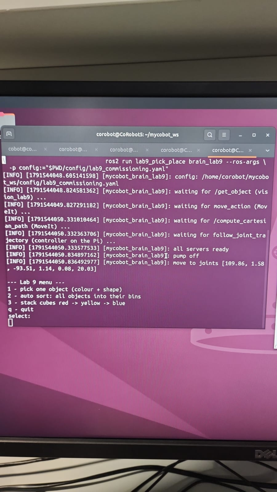
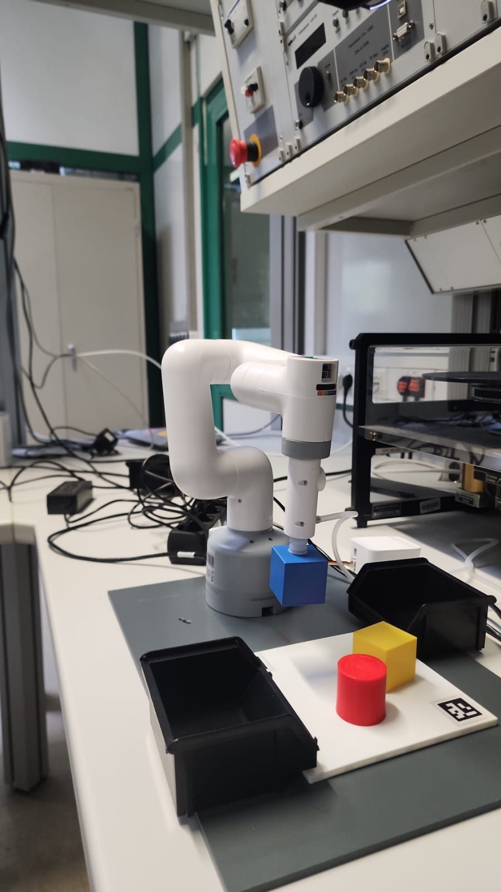
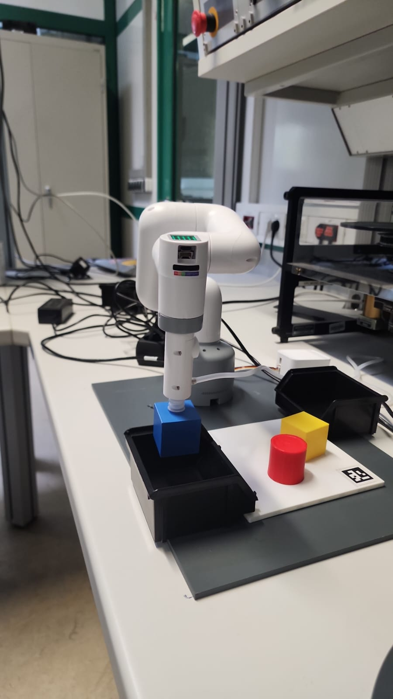

# myCobot 280 — vision-guided pick and place

ROS 2 Jazzy workspace for the CoRobot lab's myCobot 280, USB camera and vacuum
end effector. A PC detects coloured cubes/cylinders and plans motions with
MoveIt; the robot's Raspberry Pi executes joint trajectories and controls suction.
This README documents the `lab9_pick_place` system used in the current setup.

<p align="center">
  
</p>

## What is working

- Camera capture at **640 × 480**, with a live preview.
- Vision detection and `/get_object` service responses.
- Pi joint states at approximately **20 Hz**.
- Collision checking and planning-only home checks.
- A blue cube lifted by suction and transported over a bin in the supplied photos.

The photos do not independently confirm final release. Automatic sorting,
stacking, and calibrated accuracy across the whole workspace still require
separate evaluation. The active vision uses **two marker centres**, not the
eight-corner solvePnP calibration extension; that extension remains unresolved.

## Robot, frames and architecture

The arm has six controlled joints and a vacuum nozzle. The controller uses
`/dev/serial0` at **1,000,000 baud**, with BCM GPIO **20** for the pump and **21**
for the release valve. Confirm the wiring before using another robot.

Robot positions use base frame `g_base`: **+X forward, +Y left, +Z up**.
ROS service positions and YAML geometry use **metres**, angles use **radians**
unless a field explicitly ends in `_deg`. Vendor `get_coords()` reports flange
XYZ in **millimetres** and orientation in **degrees**. Flange coordinates are not
suction-tip coordinates.



| Runs on | Component | Purpose |
| --- | --- | --- |
| PC | `mycobot_280pi opencv_camera` | Persistent camera capture and optional preview |
| PC | `lab9_pick_place vision_lab9` | Marker mapping, HSV masks, shape classification, object services |
| PC | `lab9_pick_place lab9_moveit.launch.py` | Planning scene, planners and execution interface |
| PC | `lab9_pick_place brain_lab9` | Home, object selection, pick/drop, sort and stack menu |
| Pi | `controller_lab9.py` | Serial control, joint states, trajectory action server, pump/valve |

Do not run the separate YOLO `vision` pipeline, original course brain, or a second
vision/controller alongside this workflow. `lab9_real.launch.py` also starts a
camera and vision, so do not combine it with the individual commands below.

## Configuration

| File | Used by |
| --- | --- |
| [src/lab9_pick_place/config/lab9.yaml](src/lab9_pick_place/config/lab9.yaml) | Default `vision_lab9` and default brain |
| [config/lab9_commissioning.yaml](config/lab9_commissioning.yaml) | Brain command below; MoveIt velocity/acceleration scaling requested at 0.2 |
| [src/lab9_pick_place/lab9_pick_place/controller_lab9.py](src/lab9_pick_place/lab9_pick_place/controller_lab9.py) | Source to copy to Pi |

Current **commissioning** configuration:

| Parameter | Value |
| --- | --- |
| Marker dictionary / IDs | `DICT_6X6_50` / 1 and 2 |
| Marker 1 centre XY | `(135, −60)` mm |
| Marker 2 centre XY | `(255, 60)` mm |
| Camera height above plate | `470` mm |
| Board surface Z / cube height | `12` mm / `35` mm |
| Workspace X / Y | `120–265` mm / `−75–75` mm |
| Red bin centre XY | **`(120, 120)` mm** |
| Yellow bin centre XY | `(200, −120)` mm |
| Blue bin centre XY | `(200, −120)` mm |
| Tip below MoveIt `pump_head` | `28` mm (verify against actual tool) |
| Hover above contact / release-tip Z | `70` mm / `100` mm |
| Home joints, degrees | `[109.86, 1.58, −93.51, 1.14, 0.08, 20.03]` |

Yellow and blue currently share a destination in the commissioning file. The
default package YAML may contain different destinations; the explicitly selected
brain config controls the run. Keep shared camera, marker, object and workspace
values consistent between vision and brain. YAML is read at startup: restart the
affected node after editing. MoveIt scaling does not guarantee a particular
physical speed: the Pi controller applies its own waypoint timing and speed bounds.

## Prerequisites and build

The current lab machines use Ubuntu 24.04 / ROS 2 Jazzy. Connect the **USB camera
to the PC** and the robot serial/GPIO hardware to the **Pi**. Both machines need
network connectivity and `ROS_DOMAIN_ID=47`.

The PC needs MoveIt, ROS message packages, `cv_bridge`, OpenCV with `cv2.aruco`,
NumPy, SciPy, PyYAML and colcon. The Pi needs Jazzy, NumPy, `pymycobot`, GPIO support
and the controller's ROS message packages. Dependencies are not bundled in this
repository. Verify the Pi imports below before starting hardware.

Build this existing checkout from a fresh PC terminal outside the notebook venv:

```bash
cd ~/mycobot_ws
source /opt/ros/jazzy/setup.bash
colcon --log-base log/lab-import build \
  --build-base build/lab-import \
  --install-base install/lab-import \
  --symlink-install \
  --packages-up-to mycobot_brain mycobot_vision lab9_pick_place \
    mycobot_280pi mycobot_controller
source install/lab-import/setup.bash
```

Use `install/lab-import/setup.bash` for this workflow, not the old root overlay.
Rebuild after package metadata, dependencies, entry points, interfaces or installed
resources change. Existing Python-module edits usually work through symlink install.
Do not copy PC `build/` or `install/` to the Pi, or mix ROS distributions.

## Safety before starting

- Keep the workspace clear of hands, cables and loose objects during motion.
- Verify marker placement, object coordinates, tool offsets and physical bin centres.
- Run only **one** program owning the robot serial port/GPIO. Shut down robot-control
  Jupyter kernels; closing their browser tab does not stop them.
- Run collision and home-planning checks before the brain. Never disable collision
  checking to get past a failed start state.
- **Starting the brain immediately commands home.** Keep the robot's power switch
  accessible and use the lab's emergency-stop procedure.
- The current controller has no trajectory cancellation callback. **Ctrl+C or a
  MoveIt timeout is not proof that the robot stopped.** Stop unexpected physical
  motion using the lab's hardware stop/power procedure.
- Support the arm before releasing motors. It can fall; never force powered joints.
- Begin with one object. Validate suction, lift and release before automatic modes.
- Bins are not modelled as collision objects by this brain. Check clearance yourself.

## Run from scratch

Stop existing nodes first. Leave each new node running in its own terminal.
The example Pi IP is **129.217.130.11**; substitute its current IP if it changes.

### 1. PC terminal 1 → Pi controller

```bash
ssh cobot@129.217.130.11
```

The following commands run **on the Pi**:

```bash
source /opt/ros/jazzy/setup.bash
export ROS_DOMAIN_ID=47
unset ROS_LOCALHOST_ONLY ROS_AUTOMATIC_DISCOVERY_RANGE

python3 -c "import numpy, rclpy, RPi.GPIO; from pymycobot.mycobot280 import MyCobot280; from control_msgs.action import FollowJointTrajectory; print('Dependencies OK')"
sudo fuser -v /dev/gpiochip* /dev/serial0
```

If the devices have no owner:

```bash
python3 ~/mycobot_lab9/controller_lab9.py
```

Expected: `Pump ready!`, `FJT action server ready!`, and current coordinates.

If the script is missing, create its folder on the Pi:

```bash
mkdir -p ~/mycobot_lab9
```

Then copy it from a **separate PC terminal**, not from inside SSH:

```bash
scp ~/mycobot_ws/src/lab9_pick_place/lab9_pick_place/controller_lab9.py \
  cobot@129.217.130.11:~/mycobot_lab9/
```

### 2. PC terminal 2 → camera

```bash
cd ~/mycobot_ws
source /opt/ros/jazzy/setup.bash
source install/lab-import/setup.bash
export ROS_DOMAIN_ID=47
unset ROS_LOCALHOST_ONLY ROS_AUTOMATIC_DISCOVERY_RANGE

ros2 run mycobot_280pi opencv_camera --ros-args \
  -p num:=0 -p width:=640 -p height:=480 \
  -p show_preview:=true
```

Expected: `Camera /dev/video0: actual image 640x480` and a preview window.
Use the correct device index if `v4l2-ctl --list-devices` shows another camera.

### 3. PC terminal 3 → vision

```bash
cd ~/mycobot_ws
source /opt/ros/jazzy/setup.bash
source install/lab-import/setup.bash
export ROS_DOMAIN_ID=47
unset ROS_LOCALHOST_ONLY ROS_AUTOMATIC_DISCOVERY_RANGE

ros2 run lab9_pick_place vision_lab9
```

Keep both markers visible while the initial mapping is captured. Confirm the
workspace outline matches the plate and the object labels look reasonable.
Keys: **c** re-reads marker mapping; **s** saves raw/annotated frames in
`src/lab9_pick_place/frames/`. Re-read after moving the board or camera.

<p align="center">
  
</p>

### 4. PC terminal 4 → MoveIt

```bash
cd ~/mycobot_ws
source /opt/ros/jazzy/setup.bash
source install/lab-import/setup.bash
export ROS_DOMAIN_ID=47
unset ROS_LOCALHOST_ONLY ROS_AUTOMATIC_DISCOVERY_RANGE

ros2 launch lab9_pick_place lab9_moveit.launch.py
```

Wait for `You can start planning now!`.

### 5. PC terminal 5 → checks

```bash
cd ~/mycobot_ws
source /opt/ros/jazzy/setup.bash
source install/lab-import/setup.bash
export ROS_DOMAIN_ID=47
unset ROS_LOCALHOST_ONLY ROS_AUTOMATIC_DISCOVERY_RANGE

ros2 topic hz /joint_states
```

Confirm about **20 Hz**, then press **Ctrl+C** in this terminal only.

```bash
python3 scripts/check_robot_state.py
python3 scripts/plan_home_only.py
```

Required results:

```text
CURRENT_STATE_VALID: True
PLAN_ERROR_CODE: 1
TRAJECTORY_POINTS: <positive number>
No trajectory was executed.
```

The home check requests a plan only. A successful plan is not physical validation
of an inaccurate scene or a misplaced obstacle.

Request an object that is actually present:

```bash
ros2 service call /get_object lab9_interfaces/srv/GetObject \
  "{color: blue, shape: cube}"
```

Require `found=True` and check returned XY against the physical object. Multiply
metres by 1000 for millimetres. For a red **cylinder**, request `shape: cylinder`;
requesting a red cube when only a cylinder is present should return `found=False`.

### 6. PC terminal 5 → brain and one pick

**MOVES: the next command immediately commands home.**

```bash
ros2 run lab9_pick_place brain_lab9 --ros-args \
  -p config:="$PWD/config/lab9_commissioning.yaml"
```

<p align="center">
  
</p>

| Menu | Behaviour |
| --- | --- |
| `1` | Pick one selected colour/shape; choose a match if several exist; select bin after pickup |
| `2` | Automatically sort objects into configured colour bins |
| `3` | Stack cubes in configured red → yellow → blue order |
| `q` | Exit the brain and command pump off |

For the blue cube shown in the photos, enter one answer at each prompt:

```text
select: 1
colour: b
shape: c
```

If several objects match, enter the displayed selection number. Picking starts
before the bin prompt. After a successful lift:

```text
bin: blue
```

For a red cylinder: select `1`, colour `r`, shape `z`, then bin `red` after pickup.
Only use auto-sort/stack after validating the individual motions and destinations.

<table>
  <tr>
    <td></td>
    <td></td>
  </tr>
  <tr>
    <td>Observed blue-cube lift.</td>
    <td>Transport over the bin; final release is not established by this photo.</td>
  </tr>
</table>

### 7. Shutdown

1. Wait for the robot to finish its current motion.
2. Enter `q` in the brain menu (pump off may release a held object).
3. Stop vision, camera and MoveIt with **Ctrl+C** in their terminals.
4. Stop the Pi controller last with **Ctrl+C**.

For unexpected motion, use the hardware stop procedure instead of waiting for
these software shutdown steps.

## Troubleshooting

| Symptom | Check / action |
| --- | --- |
| SSH: `No route to host` | Check Pi power/network and current IP. On PC: `ip -br addr`, `ip route get 129.217.130.11`, `ping -c 3 129.217.130.11`. On Pi locally: `hostname -I`, `systemctl is-active ssh`. |
| `scp: stat local ... No such file` | Run `scp` on the PC; source file is under `/home/corobot/mycobot_ws`, not Pi `/home/cobot`. |
| `GPIO not allocated` / GPIO busy | Run `sudo fuser -v /dev/gpiochip* /dev/serial0` on Pi. Shut down the owning notebook kernel/controller. Never kill an unrelated process blindly. |
| No `/joint_states` | Controller stopped/crashed, ROS domain/network mismatch, or missing dependencies. Check Pi logs and domain 47 on both machines. |
| Camera warnings / failed capture | Stop other camera consumers. Use the persistent camera node above and actual video index. Check `v4l2-ctl -d /dev/video0 --get-fmt-video`. |
| No preview | Start camera with `-p show_preview:=true` from the PC graphical desktop, not the Pi SSH terminal. |
| Markers missing / mapping incorrect | Uncover both markers, verify dictionary/centres/height, keep camera fixed, press `c`. |
| Wrong colour or `unknown` shape | Tune `hsv`/`shape` in the vision YAML; restart vision. Separate touching objects and improve lighting. |
| `found=False` | Verify requested shape/colour, workspace bounds and fresh camera frames. The vision rejects objects older than 1 second. |
| `pump_head <-> env_camera` collision | Stop before starting brain. Inspect the scene and physically clear posture using approved hand guidance. Support the arm before motor release; re-lock and restart controller before checking again. |
| `PLAN_ERROR_CODE` other than `1` | Do not execute. Check start-state validity, goal reachability, joint limits and scene. |
| MoveIt timeout / brain abort | Do not retry while arm may still move. Observe physical stop and inspect controller logs first. |
| No suction / nozzle too high or low | Verify hose, GPIO wiring, board Z, object height and tip offset; stop rather than repeatedly pressing the object. |
| Cube does not release | Check valve operation and hose routing, with robot stationary. Do not reach under a held object during motion. |
| NumPy/cv_bridge error or segmentation fault | Use compatible system ROS/OpenCV/NumPy and rebuild Python entry points outside the notebook venv. |
| Package not found | Source Jazzy and `install/lab-import/setup.bash` in that terminal; rebuild the selected packages if missing. |
| Octomap: no 3D sensor plugin | This setup has a 2D USB camera and no configured depth updater. MoveIt can initialize, but cannot discover unmodelled obstacles automatically. |

Check device ownership without starting another controller:

```bash
# Pi
ps -ef | grep -E '[p]ython|[r]os2|[p]igpio'
sudo fuser -v /dev/gpiochip* /dev/serial0
```

The controller currently warns on an arrival timeout but can still report action
success. Confirm physical completion; menu/log success alone is insufficient.

## Calibration, HSV and limitations

The active `vision_lab9` uses a similarity mapping from two robot-measured marker
centres and an approximate object-height correction, assuming an overhead camera.
It cleans HSV masks using opening/closing and classifies contours using shape
features. Object lists are rebuilt per frame. IDs are assigned from the detected
ordering and are not persistent tracking identities.

The separate `mycobot_vision vision_calibrated` extension uses intrinsics,
eight decoded corners, planar pose checks and ray/plane intersection, but current
image diagnostics failed the configured geometry checks. It is **not used by the
run sequence above** and does not provide the `/get_object` interface required by
`brain_lab9`. Do not mark that extension complete or switch pipelines without
validation. Repository K/distortion values exist in
`src/vision/vision/vision_node.py`; their accuracy for the current capture remains
unverified.

See [the calibration workflow](docs/calibration.md) for image-only tools,
independent validation and two-lighting-condition HSV evaluation. For the active
vision, edit HSV values in the vision's YAML: JSON from `scripts/tune_hsv.py` is
for the separate calibrated node and is not automatically loaded by `vision_lab9`.

Short vertical descent/lift operations in the current brain disable collision
checking against the target. Verify those segments physically. Camera calibration,
TCP accuracy, bin clearance and reachability require new validation if the setup moves.

## Jupyter on the Pi

Stop the controller before executing robot-control notebook cells. On the Pi:

```bash
source /home/cobot/venvs/mycobot-lab/bin/activate
jupyter lab --notebook-dir=/home/cobot/mycobot_ws \
  --ip=127.0.0.1 --port=8888 --no-browser
```

In a separate PC terminal:

```bash
ssh -N -L 8888:127.0.0.1:8888 cobot@129.217.130.11
```

Open `http://localhost:8888` and enter the token printed by Jupyter. Shut down the
robot-control kernel before returning to the ROS controller.

## Evidence and checks

The selected photos show the current setup on **9 October 2026**. They are
operating evidence, not a measured accuracy or repeatability report. Historical
upstream evaluation remains separate from this setup's results.

```bash
# Geometry unit tests; this does not validate physical calibration
PYTHONPATH=src/mycobot_vision python3 -m pytest -q \
  src/mycobot_vision/test/test_aruco_geometry.py

# Optional active shape/interface evidence (vision_lab9 running)
python3 scripts/lab9_eval_logger.py query scene1
python3 scripts/lab9_eval_logger.py summary
```

The logger saves tables in `lab9/eval/`. Use vision's `s` key for matching frames.
Record independent coordinate errors, missed/false detections under two lighting
conditions, and actual pick/release outcomes for the assignment report.

## Acknowledgements and resources

We acknowledge **TU Dortmund University and the RST Chair (Control Theory and
Systems Engineering)** for the robotics laboratory and teaching context of this
project. We thank the lab teaching team and acknowledge the contributors to the
original course code and the imported `myCobot-lab` implementation.

- [TU Dortmund University](https://www.tu-dortmund.de/en/)
- [RST Chair — official website](https://rst.etit.tu-dortmund.de/en/)
- [RST research profile — Faculty of Electrical Engineering and Information Technology](https://etit.tu-dortmund.de/en/forschung/control-system-technology/)
- [Elephant Robotics — myCobot 280 Pi documentation](https://docs.elephantrobotics.com/docs/mycobot_280_pi_en/)
- [pymycobot — official Python SDK and examples](https://github.com/elephantrobotics/pymycobot)
- [myCobot 280 Python API reference](https://github.com/elephantrobotics/pymycobot/blob/main/docs/MyCobot_280_en.md)
- [mycobot_ros2 — official ROS 2 packages](https://github.com/elephantrobotics/mycobot_ros2)

Consult each resource's supported model, firmware and ROS branch before applying
its commands. These acknowledgements preserve attribution; they do not change
upstream licenses or imply institutional endorsement of local modifications.

## Repository layout and provenance

```text
mycobot_ws/
├── README.md                 # Main setup, run and troubleshooting guide
├── src/                      # ROS packages, robot models and MoveIt configuration
├── config/                   # Runtime and calibration configurations
├── scripts/                  # Diagnostics, calibration and evaluation utilities
├── notebooks/                # Jupyter coursework
├── docs/
│   ├── images/               # Five selected current lab photographs
│   └── calibration.md        # Separate calibration/HSV workflow
├── calibration_patterns/     # Printable chessboard
├── requirements/             # Existing dependency snapshots
├── resources/weights/        # Model weights for the separate YOLO pipeline
├── upstream_lab/             # Imported provenance and original reference material
├── backups/                  # Local recovery archives; ignored by Git
├── build/                    # Generated; ignored by Git
├── install/                  # Generated; ignored by Git
└── log/                      # Generated; ignored by Git
```

Camera inspection images, diagnostic JSON, local evaluation output, Python
caches, notebook checkpoints and virtual environments are also ignored. Keep
runtime configuration and selected report evidence under version control. The
source layout is intentionally unchanged so ROS package discovery, launch paths
and notebook imports continue to work.


- `src/`: ROS packages, models, MoveIt configuration and runtime source.
- `config/`: commissioning configuration and separate calibration configurations.
- `scripts/`: diagnostics, planning-only checks, calibration/HSV tools and evaluation.
- `notebooks/`: Jupyter coursework; preserved during cleanup.
- `docs/`: selected current photos and the calibration workflow.
- `upstream_lab/`: source provenance and retained upstream solutions/reference guides.
- `backups/`: ignored, local recovery archives of pre-import and removed temporary files.
- `build/`, `install/`, `log/`: generated per machine; ignored by Git.

Source imported from [manojkumar-org/mycobot-project](https://github.com/manojkumar-org/mycobot-project)
branch **myCobot-lab**, commit `f7f05f0a3c3bfa5de49a1a93df3bae1937770973`.
See [IMPORT.json](upstream_lab/IMPORT.json). The current checkout's Git origin/history
were retained; `git pull` does not automatically refresh that imported branch.

Local changes include persistent camera capture/preview, explicit HIGH GPIO
initialization, collision/home checks, commissioning configuration and bin updates.
Do not run commands from historical reports without adapting paths and checking
their measurements. Package-specific READMEs and original notebooks remain intact.

Remote course-pipeline fixes are retained in `mycobot_brain` and the legacy
`mycobot_vision vision` entry point, using `aruco_geometry_legacy.py` for its
original calibration interface. The strict `vision_calibrated` extension retains
its own geometry checks. Neither replaces the active `lab9_pick_place` run above.
The additional `README_ROBOT_PC.md` documents that separate course pipeline.
